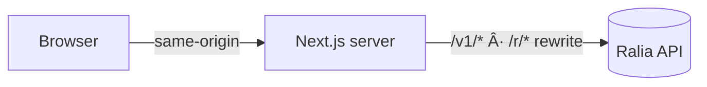

<div align="center">

# 🧑‍💼 Ralia for Business

### Book real reach. Pay for verified results.

<br/>


</div>

---

The **client** app is where a business launches a campaign, watches it fill with promoters, and
reviews the **verified** proof of every post it paid for. It's a Next.js app that proxies the API
server-side — so the browser is always same-origin and there's **no CORS to manage**.

## 🎯 Create-campaign wizard

```mermaid
flowchart LR
    A["📝 Brief<br/>name · objective · link<br/>run window · cadence"] --> B["🎨 Assets<br/>upload or ask Ralia"]
    B --> C["🎯 Targeting<br/>multi-select: location, age,<br/>gender, language, category, platform"]
    C --> D["💵 Live quote<br/>slider · slots × posts"]
    D --> E["🔒 Fund<br/>escrow → LIVE"]

    classDef s fill:#fff1f2,stroke:#E11D48,color:#881337;
    class A,B,C,D,E s;
```



- **Multi-day campaigns** — pick a run window and a cadence (one-off, daily, weekly, or a custom
  number of posts). The quote scales with posts, so pricing is always honest.
- **Multi-select targeting** — target several states, ages, languages, categories and platforms at
  once; the live quote moves with every choice.

## 🖼️ Evidence gallery

Every approved post shows up as a screenshot card — filterable by platform, zoomable, with the
verified view count. The client **only ever sees approved work**: nothing appears until an admin
has verified it.

```mermaid
flowchart LR
    P[📣 Promoter posts] --> Adm{🛡️ Admin verifies}
    Adm -->|approved| G[🖼️ Evidence gallery]
    Adm -->|rejected| X[❌ never shown to client]
    classDef ok fill:#dcfce7,stroke:#16a34a,color:#14532d;
    class G ok;
```



## 🧭 How it talks to the API



`next.config.mjs` rewrites `/v1` and `/r` to `API_ORIGIN` on the server — set it to the deployed
API URL in production.

## 🚀 Quickstart

```bash
npm install
cp .env.example .env     # set API_ORIGIN (defaults to http://localhost:6100)
npm run dev              # http://localhost:6300
```

Seeded logins: `client1@ralia.test` / `client2@ralia.test` · password `Password123!`

<details>
<summary><b>🔐 Environment</b></summary>

| Variable | Purpose |
|---|---|
| `API_ORIGIN` | The API origin the Next server proxies `/v1` + `/r` to |
| `NODE_ENV` | `production` in deploys |
</details>

<details>
<summary><b>🛠️ Scripts</b></summary>

| Script | Does |
|---|---|
| `dev` | dev server on :6300 |
| `build` | production build |
| `start:prod` | `node server.js` (only for a self-hosted Node host; Vercel builds natively) |
| `typecheck` | `tsc --noEmit` |
</details>

## 🚢 Deployment

Deploys to **Vercel** (native Next.js) — import the repo, set `API_ORIGIN` + `NEXT_PUBLIC_APP_ENV`, and Vercel builds each push. See `DEPLOY.md`.

---

<div align="center">
<sub>Part of Ralia · <a href="../ralia-api">API</a> · <a href="../ralia-admin">Admin</a> · <a href="../ralia-promoter">Promoter</a></sub>
</div>
